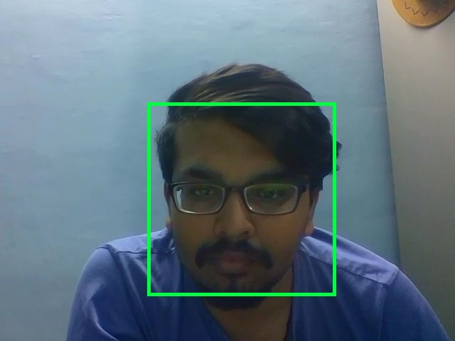

# OpenCV-miniProject-FaceDetection
## Webcam Face Recognition Program

Webcam Face Detection Program built in **python**.

## Pre-Requisites:
1. OpenCV installed
2. You need a working webcam for this script to work properly.
3. Make sure to use OpenCV v2.
4. Knowledge of Python and cascades :P
5. Knowledge of Classifiers 

## Cascades:
 The cascades themselves are just a bunch of XML files that contain OpenCV data used to detect objects. You initialize your code with the cascade you want, and then it does the work for you.

Since face detection is such a common case, OpenCV comes with a number of built-in cascades for detecting everything from faces to eyes to hands and legs. There are even cascades for non-human things. Like a banana or middle finger :P :P 

## Run the program:

*python webcam.py*

Update: Now supports OpenCV3. This change has been made on Linux.

To run the OpenCV3 version, run python webcam_cv3.py haarcascade_frontalface_default.xml

## Note:

~~~~
You can also provide a video file and Python will read in the video file. However, you need to have ffmpeg installed for that since OpenCV itself cannot decode compressed video, that's bad i know :P . ffmpeg acts as the front end for OpenCV, and it should be compiled directly into OpenCV. This is not easy to do, especially on Windows.

~~~~

## Test Results:

I have tested the above program on both **Linux** and **Windows** Operating systems and have recieved positive results using my stock webcam on
Hewlett Packard 64bit system.

### Successful Test

### Test case 2

## Upcoming Push:

Wanna contribute to the more advanced version 2.0 of this mini project :

The upcoming project will be Faces recognition example using eigenfaces and SVMs:

Take a glance : [here](http://scikit-learn.sourceforge.net/0.6/auto_examples/applications/plot_face_recognition.html)

